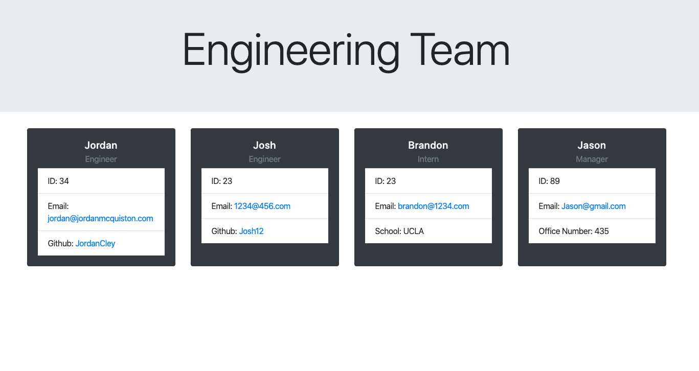

# Team-CLI

Team CLI is a command line tool that allows a user generate an html file that consists of
his or her team. The user will be prompted using inquirer to input employee properties, such as
name, email, id, role as well as a few others depending on their role within the company.

## Node.js, Bootstrap, Inquirer

## Deployed URL
[Team-CLI](https://jordancley.github.io/Team-CLI/)

## Author

* **Jordan McQuiston** 